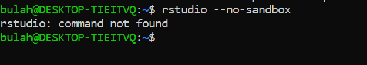

---

# Objectives

- Be able to do arithmetic in R

- Be able to create the common R objects

- Understand the type of objects

- Import and export data

- Data manipulation with {dplyr}

- *Data visualization with {ggplot2}


&nbsp;

# Questions

- What will these lessons not cover?


&nbsp;

# Introduction

## Prepare the tutorial folder

- Open the terminal. Execute the following commands one by one.

  - *$ cd ~/Document*

  - *$ git clone https://github.com/bulahwoo/r_tutorial_part1.git*

  - *$ cd ./r_tutorial_part1*

  - *$ pwd*

  
- Check the content of the current directory by

  - *$ ls -lh ./*


&nbsp;

## Install R

- Are you in the `r_tutorial_part1` directory (folder)? Check by:

  - *$ pwd*
  
- Is R already installed? You can check by:

  - *$ R*

---

- If you see something like this, R is installed. Skip the next step.

```{r r001, echo=FALSE, out.width = "600px"}
knitr::include_graphics("part1_raw/r01.png")
```

---

- If you see something like this, R is not installed. Execute the bash script:

  - *$ bash ./install/r_install.sh*

 


&nbsp;

## R console

- By typing “R” at a prompt, you will open the R console.

  - *$ R*

```{r r01, echo=FALSE, out.width = "600px"}
knitr::include_graphics("part1_raw/r01.png")
```

---

- How to quit R console? Type `q()` and `Enter` to quit R.

- A blinking "caret" appear next to the "greater than" sign `>`, referred to as a **prompt**. This is where you'll type R commands.

- Type `3 + 12` at the prompt, and press "enter" to execute the command.

```{r r02, echo=FALSE, out.width = "600px"}

```

---

- Try these arithmetic operators:

| Operator | Name |
| :--: | :-- |
| + | Addition |
| - | Subtraction |
| * | Multiplication |
| / | Division |
| ^ | Exponent |
| %% | Modulus (Remainder from division) |

```{r r03, echo=FALSE, out.width = "600px"}

```

---

- Try to use `Up` and `Down` keys to view the previous command lines.


&nbsp;

## Install RStudio

- RStudio is an integrated development environment (IDE) for R.

- IDE is a software application that helps programmers develop software code efficiently.

  - Syntax highlighting
  
  - Intelligent code completion
  
  - Code editing automation
  
  - and more...

- Are you in the `r_tutorial_part1` directory (folder)? Check by:

  - *$ pwd*
  
- Is RStudio already installed? You can check by:
  
  - *$ rstudio \-\-no-sandbox*

---

- If you see something like this, RStudio is installed. Skip the next step.

```{r r002, echo=FALSE, out.width = "600px"}
knitr::include_graphics("part1_raw/fig01.jpg")
```

---

- If you don't see RStudio window, RStudio is not installed. Execute the bash script:

  - *$ bash ./install/for_rstudio_install.sh*




&nbsp;

## RStudio interface

- Open the terminal and move to the directory `r_tutorial_part1`.

  - *$ cd ~/Document/r_tutorial_part1*

- Launch RStudio by:

  - *$ rstudio \-\-no-sandbox*

```{r rs01, echo=FALSE, out.width = "600px"}
knitr::include_graphics("part1_raw/fig01.jpg")
```

---

- Go to the file menu (upper-left corner) and click `File` --> `New File` --> `R Script`.

```{r rs02, echo=FALSE, out.width = "600px"}
knitr::include_graphics("part1_raw/rstudio_session_default.png")
```

---

- Move the mouse cursor to the console panel (bottom-left), and repeat what we did previously in the R console.

```{r, eval=FALSE}
3 + 12
20 - 3
5 * 10
30 / 3
2 ^ 3
19 / 5
19 %% 5
```

---

- Write your code in the source panel and save it

  - Copy the command lines above, and paste the command lines above to the source panel.
  
  - Go to the file menu (upper-left corner) and click `File` --> `Save`. ***It is recommended to avoid using spaces when naming files and folders. Instead, substituting them with underscores, for example, "my_script".***

  - In the source panel, move the mouse cursor to line 3.

  - Press <span style="color: red;">`Ctrl + Enter`</span> keys (Press the `Ctrl` key, hold it, then press the `Enter` key, and finally release both keys at the same time.)

  - You can see, in the console panel, the command (line 3) was executed and the result is displayed.

  - Try to execute the rest of the code by using `Ctrl + Enter` keys in the source panel.


&nbsp;

## Assignment operator `<-`

- <span style="color: brown;">NAME</span> `<-` <span style="color: cornflowerblue;">OBJECT</span>

- Create an object <span style="color: cornflowerblue;">OBJECT</span>, and name it <span style="color: brown;">NAME</span>.

- ***Spaces are NOT OK inside <span style="color: brown;">NAME</span>.***

  - Don't do this:
  
  ```{r, error=TRUE}
  my car <- 5
  ```

---

- Logical, Integer, Double, and Character type

  - Integer (such as **1**, **53**, **221**) and double (such as **0.3**, **1.89**, **41.333**) are known as numeric type

```{r object01, echo=FALSE, out.width = "600px"}
knitr::include_graphics("part1_raw/object.png")
```

---

- Let's create an object <span style="color: cornflowerblue;">13.6</span>, and give it a name <span style="color: brown;">**jojo**</span>.

```{r}
jojo <- 13.6
```

- We can print the object by typing the name of it and hitting `Enter`.

```{r}
jojo
```

---

- Create a character object <span style="color: cornflowerblue;">VINO</span>, and give this object a name <span style="color: brown;">**kiki**</span>.

```{r}
kiki <- "VINO"
kiki
```

---

- Let's create two objects and name them <span style="color: brown;">**money**</span> and <span style="color: brown;">**note**</span>.

```{r}
money <- 1000
note <- "1000"
```

```{r}
money
note
```

- What's the difference between the objects money and note?

  - When the object money was created, 1000 was **enclosed in <span style="color: red;">quotation marks (")</span>**. Therefore, money is a **character** object.

  - When the object note was created, 1000 was **NOT enclosed in <span style="color: red;">quotation marks (")</span>**. Therefore, note is a **numeric** object.

---

- Use the function typeof() to check the property of an object.

```{r}
typeof(money)
typeof(note)
```

---

- What would happen if you do basic arithmetic operations on a character object?

```{r, error=TRUE}
money + note
```

---

- Now you know how to create a character object and a numeric object. Let's see what a **logical** object is.

```{r}
12 == 12
12 == 20
```

In R, `TRUE` and `FALSE` are reserved words denoting logical constants.

```{r}
duck <- 12 == 12
goose <- FALSE
```

```{r}
duck
goose
```


&nbsp;

## Vector

- A one-dimensional data structure that holds elements **of the same data type**.

- Create a vector with the c() function.

```{r}
investment <- c("CZK", "EUR", "USD")
earning <- c(300, 50, 2)
cash <- c(T, F, F) # identical to cash <- c(TRUE, FALSE, FALSE)
```

```{r}
investment
earning
cash
```

---

- You can access a single element in a <span style="color: blue;">vector</span> by its position, aka <span style="color: purple;">**index**</span>.

- In R, indexes start at 1 -- the 1st element is at index 1.

- Indexes are **numeric**.

- <span style="color: blue;">VECTOR</span>[<span style="color: purple;">INDEX</span>]

```{r}
investment[1]
earning[2]
cash[3]
```

---

- You can access a set of specific elements by their indexes.

- Remember, indexes are numeric. Use the function c() to create a numeric vector that holds the indexes.

```{r}
investment
investment[c(1,2)]
investment[c(3,1,2)]
```


&nbsp;

## Data frame

- Data in the format of a table where the columns are vectors that all have the same length.

- Similar to spreadsheet in Excel, with one key difference: each column contain a single type of data (e.g., characters, numeric, or logical)

```{r df01, echo=FALSE, out.width = "600px"}
knitr::include_graphics("part1_raw/data-frame.svg")
```

---

Let's create a data frame like the above. The function `data.frame()` will do the job.

```{r}
data.frame(c(1, 7, 3, 4), c("S", "A", "U", "T"), c(TRUE, FALSE, TRUE, TRUE))
```

We can give a name to the data frame above.

```{r}
df01 <- data.frame(c(1, 7, 3, 4),
                   c("S", "A", "U", "T"),
                   c(TRUE, FALSE, TRUE, TRUE))
df01
```

---

When you combine 3 vectors, you combine these vectors **column-wise**.


```{r df02, echo=FALSE, out.width = "600px"}
knitr::include_graphics("part1_raw/data-frame2.svg")
```

---

- The data frame **df01** is a 2-dimensional object. The 1st dimension corresponds to the rows, while the 2nd dimension corresponds to the columns.

```{r df03, echo=FALSE, out.width = "600px"}
knitr::include_graphics("part1_raw/dataframe3.png")
```

- How to access the element "U" in the data frame `df01`? It is at the 3rd row & the 2nd column.

```{r}
df01[3, 2]
```

---

- We can use the function `colnames()` to rename each column in a data frame.

- Firstly, we can view what are the current column names of the data frame `df01`.
  
```{r}
colnames(df01)
typeof(colnames(df01)) # use typeof() to check the type of any object
```
- Secondly, to change the names, we assign a character vector to `colnames(df01)`. This will overwrite the original values stored in `colnames(df01)`.

```{r}
colnames(df01) <- c("Fruit", "Initial", "Stock")
```

- We then check the updated `colnames(df01)` and `df01`.

```{r}
colnames(df01)
df01
```

---

- Similarly, we can use the function `rownames()` to rename each row in a data frame.

  - Firstly, view what are the current row names of the data frame `df01`.

  - Secondly, to change the names, assign a character vector to `rownames(df01)`. Name them whatever you like.

  - Thirdly, check the updated `rownames(df01)` and `df01`

```{r}
rownames(df01)
typeof(rownames(df01))
rownames(df01) <- c("sample1", "sample2", "sample3", "sample4")
rownames(df01)
df01
```


&nbsp;

## Export data frame from R

- It is nice to check your current directory (folder) before saving files.

- Use the function `getwd()` to see the current directory (folder) you are at.

```{r, eval=FALSE}
getwd()
```

---

- **Comma-separated values (CSV)** is a text file format that uses commas (",") to separate values.

- **Tab-separated values (TSV)** is a text file format that uses tabs ("\t") to separate values.

- Pay attention to the **field separator (delimiter)** used in your data.

- Let's view the manual of the function `write.table()` by typing `?write.table` in the console.

```{r}
?write.table
```

- Most of the time, the default setting would be just fine. Here we use the data frame `df01` to explore the parameter settings and compare the resulting files.

```{r}
df01 <- data.frame(c(1, 7, 3, 4),
                   c("S", "A", "U", "T"),
                   c(TRUE, FALSE, TRUE, TRUE))
colnames(df01) <- c("Fruit", "Initial", "Stock")
rownames(df01) <- c("sample1", "sample2", "sample3", "sample4")
df01
```

- The function `dim()` will show you the the dimension of an object. Let's try:

```{r}
dim(df01)
```

```{r}
write.table(df01, file="output/export01.txt")
write.table(df01, file="output/export02.txt", col.names = NA)
write.table(df01, file="output/export03.txt", col.names = NA, quote = FALSE)
write.table(df01, file="output/export04.txt", col.names = NA, quote = FALSE, sep = ",")
```

-  Check the resulting files in **MS Excel**. What are the differences among them?


&nbsp;

## Import data frame to R

- Let's view the manual of the function `read`.csv()` by typing `?read.table` in the console.

```{r}
?write.table
```

- Once again, we explore the parameter settings and see the differences among the results. Here, we import the file `import01.txt` under the directory `rawdata` to R.

```{r}
import_101 <- read.table("rawdata/import01.txt")
import_102 <- read.table("rawdata/import01.txt", header = TRUE)
import_103 <- read.table("rawdata/import01.txt", header = TRUE, sep = ",")
import_104 <- read.table("rawdata/import01.txt", header = TRUE, sep = ",", row.names = 1)
```

```{r}
import_101
dim(import_101)
import_102
dim(import_102)
import_103
dim(import_103)
import_104
dim(import_104)
```

- What are the differences among them?


&nbsp;
