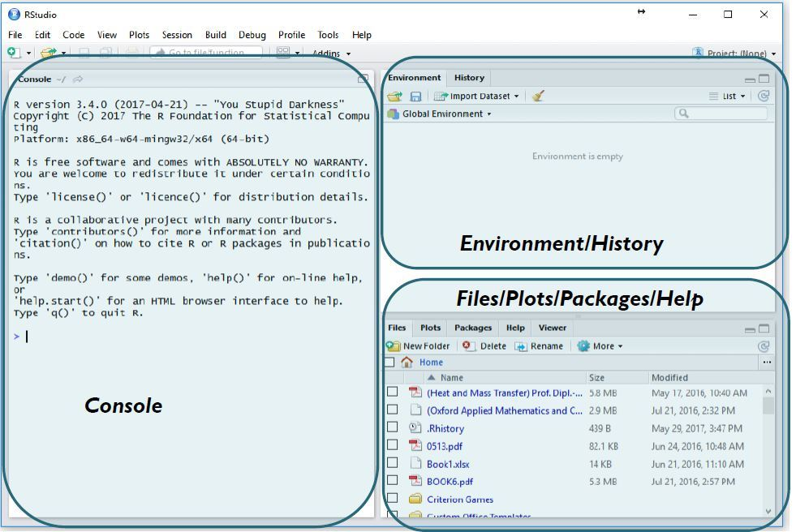
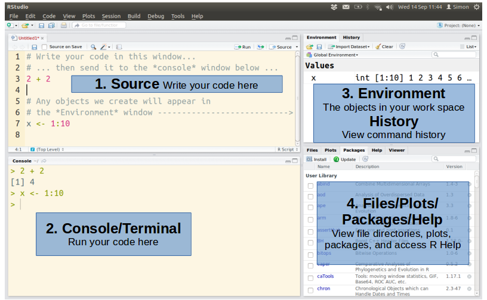

R Basics Part 1
================
Bulah Wu
17 September 2025

------------------------------------------------------------------------

# Objectives

- Be able to do arithmetic in R

- Be able to create the common R objects

- Understand the type of objects

- Import and export data

- Data manipulation with {dplyr}

- Data visualization with {ggplot2}

  

# Questions

- What will these lessons not cover?

  

# Introduction

## R console

- By typing “R” at a prompt, you will open the R console.

  - *\$ R*


------------------------------------------------------------------------

- How to quit R console? Type `q()` and `Enter` to quit R.

- A blinking “caret” appear next to the “greater than” sign `>`,
  referred to as a **prompt**. This is where you’ll type R commands.

- Type `3 + 12` at the prompt, and press “enter” to execute the command.


------------------------------------------------------------------------

- Try these arithmetic operators:

| Operator | Name                              |
|:--------:|:----------------------------------|
|    \+    | Addition                          |
|    \-    | Subtraction                       |
|    \*    | Multiplication                    |
|    /     | Division                          |
|    ^     | Exponent                          |
|    %%    | Modulus (Remainder from division) |


------------------------------------------------------------------------

- Try to use `Up` and `Down` keys to view the previous command lines.

  

## RStudio

- RStudio is an integrated development environment (IDE) for R.

- IDE is a software application that helps programmers develop software
  code efficiently.

  - Syntax highlighting

  - Intelligent code completion

  - Code editing automation

  - and more…

------------------------------------------------------------------------

- Press the Windows key, type “RStudio” into the search bar, and click
  on the RStudio icon.


  

## RStudio interface



------------------------------------------------------------------------

- Go to the file menu (upper-left corner) and click `File` –\>
  `New File` –\> `R Script`.



------------------------------------------------------------------------

- Move the mouse cursor to the console panel (bottom-left), and repeat
  what we did previously in the R console.

``` r
3 + 12
20 - 3
5 * 10
30 / 3
2 ^ 3
19 / 5
19 %% 5
```

------------------------------------------------------------------------

- Write your code in the source panel and save it

  - Copy the command lines above, and paste the command lines above to
    the source panel.

  - Go to the file menu (upper-left corner) and click `File` –\> `Save`.
    ***It is recommended to avoid using spaces when naming files and
    folders. Instead, substituting them with underscores, for example,
    “my_script”.***

  - In the source panel, move the mouse cursor to line 3.

  - Press <span style="color: red;">`Ctrl + Enter`</span> keys (Press
    the `Ctrl` key, hold it, then press the `Enter` key, and finally
    release both keys at the same time.)

  - You can see, in the console panel, the command (line 3) was executed
    and the result is displayed.

  - Try to execute the rest of the code by using `Ctrl + Enter` keys in
    the source panel.

------------------------------------------------------------------------

- use getwd() to check your current directory
- use dir.create(“~/KMB925/r_day1”) to create a new directory
- use setwd(“~/KMB925/r_day1”) to set your working directory

``` r
getwd()
dir.create("~/KMB925/r_day1")
setwd("~/KMB925/r_day1")
```

  

## Assignment operator `<-`

- <span style="color: brown;">NAME</span> `<-`
  <span style="color: cornflowerblue;">OBJECT</span>

- Create an object <span style="color: cornflowerblue;">OBJECT</span>,
  and name it <span style="color: brown;">NAME</span>.

- ***Spaces are NOT OK inside
  <span style="color: brown;">NAME</span>.***

  - Don’t do this:

  ``` r
  my car <- 5
  ```

      ## Error in parse(text = input): <text>:1:4: unexpected symbol
      ## 1: my car
      ##        ^

------------------------------------------------------------------------

- Logical, Integer, Double, and Character type

  - Integer (such as **1**, **53**, **221**) and double (such as
    **0.3**, **1.89**, **41.333**) are known as numeric type


------------------------------------------------------------------------

- Let’s create an object
  <span style="color: cornflowerblue;">13.6</span>, and give it a name
  <span style="color: brown;">**jojo**</span>.

``` r
jojo <- 13.6
```

- We can print the object by typing the name of it and hitting `Enter`.

``` r
jojo
```

    ## [1] 13.6

------------------------------------------------------------------------

- Create a character object
  <span style="color: cornflowerblue;">VINO</span>, and give this object
  a name <span style="color: brown;">**kiki**</span>.

``` r
kiki <- "VINO"
kiki
```

    ## [1] "VINO"

------------------------------------------------------------------------

- Let’s create two objects and name them
  <span style="color: brown;">**money**</span> and
  <span style="color: brown;">**note**</span>.

``` r
money <- 1000
note <- "1000"
```

``` r
money
```

    ## [1] 1000

``` r
note
```

    ## [1] "1000"

- What’s the difference between the objects money and note?

  - When the object money was created, 1000 was **enclosed in
    <span style="color: red;">quotation marks (“)</span>**. Therefore,
    money is a **character** object.

  - When the object note was created, 1000 was **NOT enclosed in
    <span style="color: red;">quotation marks (“)</span>**. Therefore,
    note is a **numeric** object.

------------------------------------------------------------------------

- Use the function typeof() to check the property of an object.

``` r
typeof(money)
```

    ## [1] "double"

``` r
typeof(note)
```

    ## [1] "character"

------------------------------------------------------------------------

- What would happen if you do basic arithmetic operations on a character
  object?

``` r
money + note
```

    ## Error in money + note: non-numeric argument to binary operator

------------------------------------------------------------------------

- Now you know how to create a character object and a numeric object.
  Let’s see what a **logical** object is.

``` r
12 == 12
```

    ## [1] TRUE

``` r
12 == 20
```

    ## [1] FALSE

In R, `TRUE` and `FALSE` are reserved words denoting logical constants.

``` r
duck <- 12 == 12
goose <- FALSE
```

``` r
duck
```

    ## [1] TRUE

``` r
goose
```

    ## [1] FALSE

  

## Vector

- A one-dimensional data structure that holds elements **of the same
  data type**.

- Create a vector with the c() function.

``` r
investment <- c("CZK", "EUR", "USD")
earning <- c(300, 50, 2)
cash <- c(T, F, F) # identical to cash <- c(TRUE, FALSE, FALSE)
```

``` r
investment
```

    ## [1] "CZK" "EUR" "USD"

``` r
earning
```

    ## [1] 300  50   2

``` r
cash
```

    ## [1]  TRUE FALSE FALSE

------------------------------------------------------------------------

- You can access a single element in a
  <span style="color: blue;">vector</span> by its position, aka
  <span style="color: purple;">**index**</span>.

- In R, indexes start at 1 – the 1st element is at index 1.

- Indexes are **numeric**.

- <span style="color: blue;">VECTOR</span>\[<span style="color: purple;">INDEX</span>\]

``` r
investment[1]
```

    ## [1] "CZK"

``` r
earning[2]
```

    ## [1] 50

``` r
cash[3]
```

    ## [1] FALSE

------------------------------------------------------------------------

- You can access a set of specific elements by their indexes.

- Remember, indexes are numeric. Use the function c() to create a
  numeric vector that holds the indexes.

``` r
investment
```

    ## [1] "CZK" "EUR" "USD"

``` r
investment[c(1,2)]
```

    ## [1] "CZK" "EUR"

``` r
investment[c(3,1,2)]
```

    ## [1] "USD" "CZK" "EUR"

  

## Data frame

- Data in the format of a table where the columns are vectors that all
  have the same length.

- Similar to spreadsheet in Excel, with one key difference: each column
  contain a single type of data (e.g., characters, numeric, or logical)


------------------------------------------------------------------------

Let’s create a data frame like the above. The function `data.frame()`
will do the job.

``` r
data.frame(c(1, 7, 3, 4), c("S", "A", "U", "T"), c(TRUE, FALSE, TRUE, TRUE))
```

    ##   c.1..7..3..4. c..S....A....U....T.. c.TRUE..FALSE..TRUE..TRUE.
    ## 1             1                     S                       TRUE
    ## 2             7                     A                      FALSE
    ## 3             3                     U                       TRUE
    ## 4             4                     T                       TRUE

We can give a name to the data frame above.

``` r
df01 <- data.frame(c(1, 7, 3, 4),
                   c("S", "A", "U", "T"),
                   c(TRUE, FALSE, TRUE, TRUE))
df01
```

    ##   c.1..7..3..4. c..S....A....U....T.. c.TRUE..FALSE..TRUE..TRUE.
    ## 1             1                     S                       TRUE
    ## 2             7                     A                      FALSE
    ## 3             3                     U                       TRUE
    ## 4             4                     T                       TRUE

------------------------------------------------------------------------

When you combine 3 vectors, you combine these vectors **column-wise**.


------------------------------------------------------------------------

- The data frame **df01** is a 2-dimensional object. The 1st dimension
  corresponds to the rows, while the 2nd dimension corresponds to the
  columns.


- How to access the element “U” in the data frame `df01`? It is at the
  3rd row & the 2nd column.

``` r
df01[3, 2]
```

    ## [1] "U"

------------------------------------------------------------------------

- We can use the function `colnames()` to rename each column in a data
  frame.

- Firstly, we can view what are the current column names of the data
  frame `df01`.

``` r
colnames(df01)
```

    ## [1] "c.1..7..3..4."              "c..S....A....U....T.."     
    ## [3] "c.TRUE..FALSE..TRUE..TRUE."

``` r
typeof(colnames(df01)) # use typeof() to check the type of any object
```

    ## [1] "character"

- Secondly, to change the names, we assign a character vector to
  `colnames(df01)`. This will overwrite the original values stored in
  `colnames(df01)`.

``` r
colnames(df01) <- c("Fruit", "Initial", "Stock")
```

- We then check the updated `colnames(df01)` and `df01`.

``` r
colnames(df01)
```

    ## [1] "Fruit"   "Initial" "Stock"

``` r
df01
```

    ##   Fruit Initial Stock
    ## 1     1       S  TRUE
    ## 2     7       A FALSE
    ## 3     3       U  TRUE
    ## 4     4       T  TRUE

------------------------------------------------------------------------

- Similarly, we can use the function `rownames()` to rename each row in
  a data frame.

  - Firstly, view what are the current row names of the data frame
    `df01`.

  - Secondly, to change the names, assign a character vector to
    `rownames(df01)`. Name them whatever you like.

  - Thirdly, check the updated `rownames(df01)` and `df01`

``` r
rownames(df01)
```

    ## [1] "1" "2" "3" "4"

``` r
typeof(rownames(df01))
```

    ## [1] "character"

``` r
rownames(df01) <- c("sample1", "sample2", "sample3", "sample4")
rownames(df01)
```

    ## [1] "sample1" "sample2" "sample3" "sample4"

``` r
df01
```

    ##         Fruit Initial Stock
    ## sample1     1       S  TRUE
    ## sample2     7       A FALSE
    ## sample3     3       U  TRUE
    ## sample4     4       T  TRUE

  

## Export data frame from R

- It is nice to check your current directory (folder) before saving
  files.

- Use the function `getwd()` to see the current directory (folder) you
  are at.

``` r
getwd()
```

------------------------------------------------------------------------

- **Comma-separated values (CSV)** is a text file format that uses
  commas (“,”) to separate values.

- **Tab-separated values (TSV)** is a text file format that uses tabs
  (“) to separate values.

- Pay attention to the **field separator (delimiter)** used in your
  data.

- Let’s view the manual of the function `write.table()` by typing
  `?write.table` in the console.

``` r
?write.table
```

    ## starting httpd help server ... done

- Most of the time, the default setting would be just fine. Here we use
  the data frame `df01` to explore the parameter settings and compare
  the resulting files.

``` r
df01 <- data.frame(c(1, 7, 3, 4),
                   c("S", "A", "U", "T"),
                   c(TRUE, FALSE, TRUE, TRUE))
colnames(df01) <- c("Fruit", "Initial", "Stock")
rownames(df01) <- c("sample1", "sample2", "sample3", "sample4")
df01
```

    ##         Fruit Initial Stock
    ## sample1     1       S  TRUE
    ## sample2     7       A FALSE
    ## sample3     3       U  TRUE
    ## sample4     4       T  TRUE

- The function `dim()` will show you the the dimension of an object.
  Let’s try:

``` r
dim(df01)
```

    ## [1] 4 3

``` r
write.table(df01, file="~/KMB925/r_day1/export01.txt")
write.table(df01, file="~/KMB925/r_day1/export02.txt", col.names = NA)
write.table(df01, file="~/KMB925/r_day1/export03.txt", col.names = NA, quote = FALSE)
write.table(df01, file="~/KMB925/r_day1/export04.txt", col.names = NA, quote = FALSE, sep = ",")
```

- Check the resulting files in **MS Excel**. What are the differences
  among them?

  

## Import data frame to R

- Let’s view the manual of the function
  `read`.csv()`by typing`?read.table\` in the console.

``` r
?read.table
```

- Once again, we explore the parameter settings and see the differences
  among the results. Here, we import the file `import01.txt` under the
  directory `rawdata` to R.

``` r
import_101 <- read.table("~/KMB925/shell-novice/shell-lesson-data/exercise-data/animal-counts/animals.csv")
import_102 <- read.table("~/KMB925/shell-novice/shell-lesson-data/exercise-data/animal-counts/animals.csv", header = TRUE)
import_103 <- read.table("~/KMB925/shell-novice/shell-lesson-data/exercise-data/animal-counts/animals.csv", header = TRUE, sep = ",")
import_104 <- read.table("~/KMB925/shell-novice/shell-lesson-data/exercise-data/animal-counts/animals.csv", header = TRUE, sep = ",", row.names = 1)
```

``` r
import_101
dim(import_101)
import_102
dim(import_102)
import_103
dim(import_103)
```

- What are the differences among them?

  
