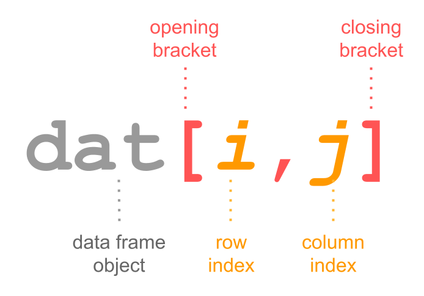

R Basics Part 2
================
Bulah Wu
18 September 2025

------------------------------------------------------------------------

# Install and load R package {dplyr}

- Use the function install.packages() to install packages from the CRAN
  repository (Comprehensive R Archive Network)

``` r
install.packages("dplyr")
```

- Use the function library() to load packages into the R session

``` r
library(dplyr)
```

  

# Review

- How to check your current directory? How to create a new directory?
  How to set your working directory?

- **numeric/character/logical** objects

- How to create an object

- What is a vector? What is the function `c()`?

- What is a data frame? What is the function `data.frame()`?

- How to use index to get the element(s) in a vector/data frame

- How to export and import tubular data (tables)

  

# More about “save your data”

## Save a script

- Paste this code to the source panel and run it.

``` r
getwd()
dir.create("~/KMB925/r_day2") # feel free to modify as needed
setwd("~/KMB925/r_day2")
```

- Click `File` -\> `Save` to save the file as “ABC.R”. You can replace
  “ABC” with any name you want.

  

## Save an object

- Consider the code above. Imagine if:

``` r
getwd()
dir.create("~/KMB925/r_day2") # feel free to modify as needed
setwd("~/KMB925/r_day2")
rawdata <- 100 * 12345    # It takes 10 seconds to create this object
table1 <- rawdata * 3     # It takes  2 weeks   to create this object
table2 <- table1 / 3      # It takes  5 minutes to create this object
figure <- table2 * 30     # It takes  2 seconds to create this object
```

- Use `saveRDS()` to save a single R object as “XXXX.rds”. Use
  `readRDS()` to load the XXXX.RDS file.

``` r
saveRDS(table1, file = "obj_01.rds")
# To test the function readRDS(), first delete the created object "table1" in this R session.
rm(table1)
readRDS("obj_01.rds")
# assign readRDS("obj_01.rds") to a name
table1 <- readRDS("obj_01.rds")
reload_table1 <- readRDS("obj_01.rds")
```

- Use `save()` to save one or multiple R object(s) as “YYYY.RData”. Use
  `load()` to load the YYYY.RData file.

``` r
save(rawdata, table1, table2, figure, file = "data_01.RData")
# To test the function readRDS(), delete the created objects in this R session:
# "rawdata", "table1", "table2", and "figure".
rm(rawdata, table1, table2, figure)
load("data_01.RData") # No need to assign objects to new names
```

------------------------------------------------------------------------

  

# Data manipulation

## Useful functions to check data structure

- For one-dimensional vector, we use:

  - `typeof()` to check the type of an object

  - `length()` to check the number of elements in an object

- Create a numeric vector and a character data frame.

``` r
chr_vec <- c("E", "O", "U", "A", "I")
num_vec <- c(34, 5, 8, 741, 1000, 27, 4444, 84, 9)
```

- To subset a vector, use VECTOR\[INDEX\]

``` r
chr_vec[2]
```

    ## [1] "O"

``` r
num_vec[c(1,4,6)]
```

    ## [1]  34 741  27

- You can use a logical vector to subset a vector

``` r
chr_vec[c(FALSE, TRUE, FALSE, FALSE, FALSE)]
num_vec[c(T, F, F, T, F, T, F, F, F)]
```

- Use `typeof()` and `length()` to check properties of the created
  vectors.

``` r
typeof(chr_vec)
```

    ## [1] "character"

``` r
length(chr_vec)
```

    ## [1] 5

``` r
typeof(num_vec)
```

    ## [1] "double"

``` r
length(num_vec)
```

    ## [1] 9

------------------------------------------------------------------------

- Two-dimensional data frame, we use:

  - `str()` to obtain the number of observations (rows) and variables
    (columns), the type, and a preview of the first few elements in each
    column

  - `dim()` to retrieve the dimensions of an object

- Use `str()` and `dim()` to check properties of the built-in data frame
  `airquality`

``` r
str(airquality)
```

    ## 'data.frame':    153 obs. of  6 variables:
    ##  $ Ozone  : int  41 36 12 18 NA 28 23 19 8 NA ...
    ##  $ Solar.R: int  190 118 149 313 NA NA 299 99 19 194 ...
    ##  $ Wind   : num  7.4 8 12.6 11.5 14.3 14.9 8.6 13.8 20.1 8.6 ...
    ##  $ Temp   : int  67 72 74 62 56 66 65 59 61 69 ...
    ##  $ Month  : int  5 5 5 5 5 5 5 5 5 5 ...
    ##  $ Day    : int  1 2 3 4 5 6 7 8 9 10 ...

``` r
dim(airquality)
```

    ## [1] 153   6

------------------------------------------------------------------------

- Honorable mentions

  - `head()` to view the first part of an object

  - `tail()` to view the last part of an object

  - `summary()` to summarize an object

- Use `head()`, `tail()`, and `summary()` to check the built-in data
  frame `airquality`

``` r
head(airquality, 7)
tail(airquality, 5)
summary(airquality)
```

  

## Subsetting data frames

- We use the bracket notation `[index_1, index_2]` to access the indices
  for the observations (rows) and the variables (columns). The first
  index is for **rows**, and the second index is for **columns**.




------------------------------------------------------------------------

- Let’s play with the built-in data frame `mtcars`.

``` r
# select row 3, columns 2
mtcars[3, 2]
```

``` r
# select row 1, columns 2 and 3
mtcars[1, c(2, 3)]
```

``` r
# select row 5, all column
mtcars[5, ]
```

``` r
# select all rows, columns 2
mtcars[, 2]
```

``` r
# select all row, columns cyl
mtcars[, "cyl"]
mtcars$cyl # dollar sign "$" is used to extract a column by name from a data frame
```

------------------------------------------------------------------------

- Create a data frame object named “bbcars”, which contains the first 10
  rows, columns 2, 3, 4, 5 and 7 from the data frame `mtcars`.

- Explain the following commands:

``` r
bbcars$cyl > 4
typeof(bbcars$cyl > 4)
str(bbcars$cyl > 4)
```

``` r
bbcars[bbcars$cyl > 4, ]
```

``` r
keep <- bbcars$cyl > 4
bbcars[keep, ]
```

------------------------------------------------------------------------

- The comparison operators: **==** (equal), **!=** (not equal), **\>**
  (greater than) and **\<** (less than)
- The logical operators **&** (and) and **\|** (or)

``` r
bbcars$hp > 100 & bbcars$hp < 150
bbcars$hp > 100 | bbcars$qsec < 18
bbcars$hp != 110 & bbcars$drat > 3.5
```

``` r
bbcars[bbcars$hp > 100 & bbcars$hp < 150, ]
bbcars[bbcars$hp > 100 | bbcars$qsec < 18, ]
bbcars[bbcars$hp != 110 & bbcars$drat > 3.5, ]
```

------------------------------------------------------------------------

- `sum()` function calculates the total sum of all the values in a
  numeric vector.

``` r
sum(bbcars$cyl)
```

- `mean()` function calculates calculates the arithmetic average of a
  numeric vector by summing all the values and dividing by the number of
  elements.

``` r
mean(bbcars$cyl)
```

------------------------------------------------------------------------

- Let’s try:

  - Filter the data frame `bbcars` to find cars with disp less than 250
    **and** with qsec greater than 17.

  - Filter the data frame `mtcars` to find cars with cyl no less than 6,
    **or** with 5 gears.

  - Compute the total of the **mpg** column and the average of the
    **drat** column from the previously filtered data frames.

  
