R Basics Part 4
================
Bulah Wu
19 September 2025

------------------------------------------------------------------------

- Reminder: set up your working directory, and load the packages needed.

``` r
getwd()
dir.create("~/KMB925/r_day3") # feel free to modify as needed
setwd("~/KMB925/r_day3")
```

``` r
library(dplyr)
library(ggplot2)
```

  

------------------------------------------------------------------------

- Let’s create a data frame called `df01` that includes details about
  each customer’s review of a restaurant and the amount of money they
  spent.

``` r
df01 <- data.frame(review = c("good", "bad", "okay", "bad", "okay", "good", "bad", "okay", "good", "okay"),
                   cost = c(100, 200, 50, 70, 300, 1000, 400, 330, 500, 600))

df01
```

    ##    review cost
    ## 1    good  100
    ## 2     bad  200
    ## 3    okay   50
    ## 4     bad   70
    ## 5    okay  300
    ## 6    good 1000
    ## 7     bad  400
    ## 8    okay  330
    ## 9    good  500
    ## 10   okay  600

- Next, we calculate the count of each review category, and save it as a
  new data frame `df02`.

``` r
df02 <- df01 %>% group_by(review) %>% summarise(total = n())

df02
```

    ## # A tibble: 3 × 2
    ##   review total
    ##   <chr>  <int>
    ## 1 bad        3
    ## 2 good       3
    ## 3 okay       4

- Create a bar chart using `{ggplot2}`

``` r
ggplot(df02, aes(x = review, y = total)) + geom_col(aes(fill = review))
```

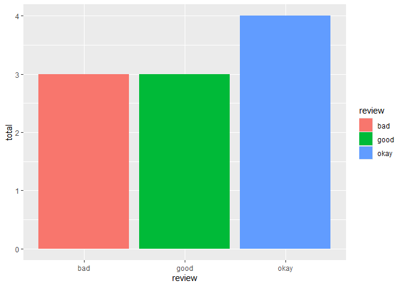<!-- -->

- Is there anything that could be improved?

  

------------------------------------------------------------------------

## Factor: categorical data

- A factor is a special data type used in R for categorical data
  (groups, classes, levels…)

- Use the `factor()` function to create a factor

``` r
f1 <- factor(c("good", "bad", "okay", "bad", "okay", "good", "bad", "okay", "good", "okay"))
f2 <- factor(c("good", "bad", "okay", "bad", "okay", "good", "bad", "okay", "good", "okay"), levels = c("bad", "okay", "good"))
f1
```

    ##  [1] good bad  okay bad  okay good bad  okay good okay
    ## Levels: bad good okay

``` r
f2
```

    ##  [1] good bad  okay bad  okay good bad  okay good okay
    ## Levels: bad okay good

- Recreate the data frame again with `review` defined as a factor
  variable.

``` r
newdf01 <- data.frame(review = factor(c("good", "bad", "okay", "bad", "okay", "good", "bad", "okay", "good", "okay"), levels = c("bad", "okay", "good")),
                      cost = c(100, 200, 50, 70, 300, 1000, 400, 330, 500, 600))
newdf02 <- newdf01 %>% group_by(review) %>% summarise(total = n())
```

- Create a bar chart using `{ggplot2}`

``` r
ggplot(newdf02, aes(x = review, y = total)) + geom_col(aes(fill = review))
```

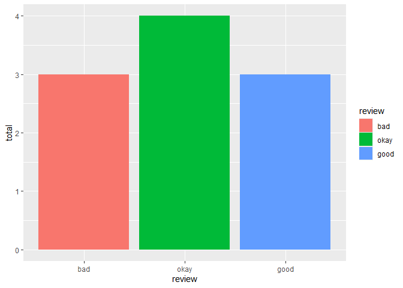<!-- -->

- The function `unique()` is used to extract distinct (non-duplicate)
  values from a vector

``` r
df01$review
```

    ##  [1] "good" "bad"  "okay" "bad"  "okay" "good" "bad"  "okay" "good" "okay"

``` r
unique(df01$review)
```

    ## [1] "good" "bad"  "okay"

  

------------------------------------------------------------------------

# Data visualization with {ggplot2}

## Install and load R package {ggplot2}

- Use the function install.packages() to install packages from the CRAN
  repository (Comprehensive R Archive Network)

``` r
install.packages("ggplot2")
```

- Use the function library() to load packages into the R session

``` r
library(ggplot2)
```

  

------------------------------------------------------------------------

## Basic syntax

- {ggplot2} is a data visualization package in R that is part of the
  {tidyverse}. It uses a grammar of graphics to construct plots layer by
  layer.

``` r
ggplot(data, aes(x = var1, y = var2)) +
  geom_*() +
  additional_layers
```

`data`: Your **data frame**.

`aes(x = var1, y = var2)`: The **aesthetic mappings**. This defines the
variables (columns) to plot on the x and y axes. You can map other
aesthetics like color, size, and so on.

`geom_*()`: The **geometric object** that defines the type of plot
(e.g., `geom_point()`, `geom_line()`, `geom_bar()`, etc.).

You can add other layers to customize your plot further, such as
`themes`, `labels`, and `scales`.

  

------------------------------------------------------------------------

## Step-by-step breakdown of {ggplot2} syntax

- To create a ggplot object:

  1.  You begin by creating the ggplot() object, which takes the dataset
      and aesthetic mappings (such as the x and y variables).

  2.  You then use a geom function like geom_point() for scatter plots,
      geom_bar() for bar charts, geom_line() for line plots, etc.

  3.  Customize the plot: Add layers for labels, themes, or other
      customization.

- Common geometric objects in ggplot2

  1.  `geom_point()`: Scatter plot

  2.  `geom_bar()`: Bar plot

  3.  `geom_histogram()`: Histogram

  4.  `geom_line()`: Line plot

  5.  `geom_boxplot()`: Box plot

  6.  `geom_col()`: Column plot (like bar plot but with pre-summarized
      data)

  

------------------------------------------------------------------------

## Basic examples

1.  Scatter plot (`geom_point()`)

``` r
# Scatter plot
ggplot(data = mpg, aes(x = displ, y = hwy)) + 
  geom_point()
```

<!-- -->

2.  Bar plot (`geom_bar()`)

``` r
# Bar plot
ggplot(data = mpg, aes(x = class)) + 
  geom_bar()
```

<!-- -->

3.  Histogram (`geom_histogram()`)

``` r
# Histogram
ggplot(data = mpg, aes(x = hwy)) + 
  geom_histogram(binwidth = 2)
```

<!-- -->

4.  Line plot (`geom_line()`)

``` r
# Line plot
ggplot(data = mpg, aes(x = displ, y = hwy)) + 
  geom_line()
```

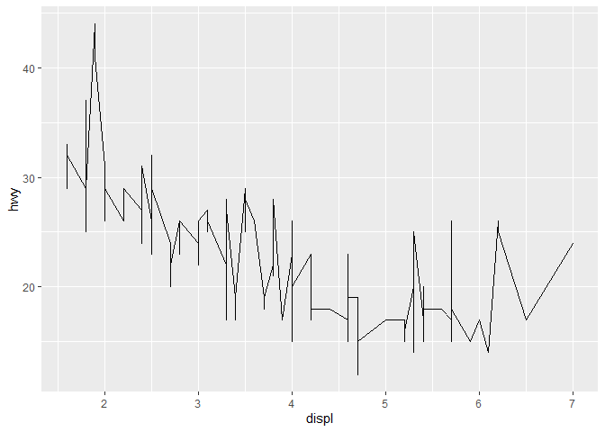<!-- -->

5.  Box plot (`geom_boxplot()`)

``` r
# Box plot
ggplot(data = mpg, aes(x = class, y = hwy)) + 
  geom_boxplot()
```

<!-- -->

6.  Column plot (`geom_col()`)

``` r
# geom_col() works with pre-summarized data
summary_mpg <- mpg %>% group_by(class) %>% summarise(count = n())
summary_mpg
```

    ## # A tibble: 7 × 2
    ##   class      count
    ##   <chr>      <int>
    ## 1 2seater        5
    ## 2 compact       47
    ## 3 midsize       41
    ## 4 minivan       11
    ## 5 pickup        33
    ## 6 subcompact    35
    ## 7 suv           62

``` r
ggplot(data = summary_mpg, aes(x = class, y = count)) +
  geom_col()
```

<!-- -->

  

------------------------------------------------------------------------

## Save output

- Create an R object and save it using the function `saveRDS()` or
  `save()`

``` r
# Box plot
myboxplot <- ggplot(data = mpg, aes(x = class, y = hwy)) +  geom_boxplot()
saveRDS(myboxplot, file = "./myboxplot.rds")
save(myboxplot, file = "./myboxplot.RData")
```

- Use `ggsave()` to save the plot

``` r
# Box plot
myboxplot <- ggplot(data = mpg, aes(x = class, y = hwy)) +  geom_boxplot()
ggsave("myboxplot.pdf", plot = myboxplot)
ggsave("myboxplot.pdf", plot = myboxplot, width = 20, height = 20, units = "cm")
```

- `ggsave()` automatically saves the last plot displayed, so you don’t
  need to assign your plot to an object (unless you want to reuse it).

``` r
# Box plot
ggplot(data = mpg, aes(x = class, y = hwy)) +  geom_boxplot()
ggsave("myboxplot.pdf")
```

  

------------------------------------------------------------------------

## Customizing plots

- You can customize your plots further by adding other layers such as
  titles, axis labels, themes, and changing the colors or shapes.

1.  Customizing the title and axis labels

``` r
ggplot(data = mpg, aes(x = displ, y = hwy)) + 
  geom_point() +
  labs(title = "Displacement vs Highway MPG", x = "Engine Displacement (L)", y = "Highway MPG")
```

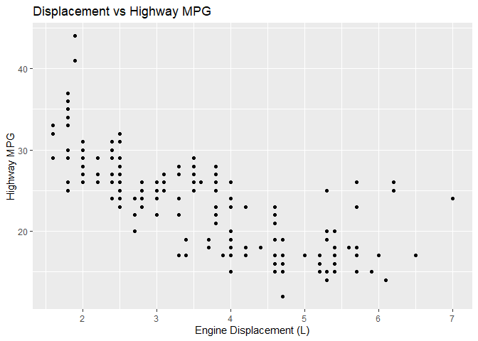<!-- -->

2.  Changing the color of points

``` r
ggplot(data = mpg, aes(x = displ, y = hwy, color = class)) + 
  geom_point()
```

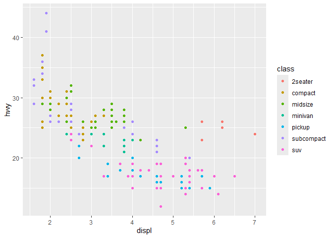<!-- -->

3.  Filling / outlining the boxplots with color

``` r
# fill the boxplots with orange color, and outline the boxplots with skyblue color
ggplot(data = mpg, aes(x = class, y = hwy)) +
  geom_boxplot(fill = "orange", color = "skyblue")
```

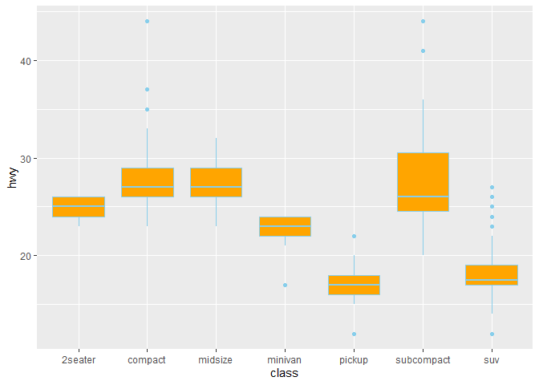<!-- -->

``` r
# fill the boxplots by class
ggplot(data = mpg, aes(x = class, y = hwy, fill = class)) +
  geom_boxplot()
```

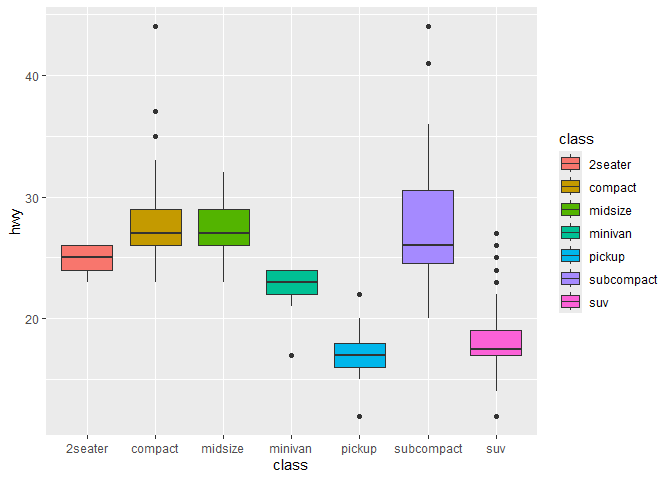<!-- -->

4.  Adding themes

``` r
ggplot(data = mpg, aes(x = displ, y = hwy)) + 
  geom_point() +
  theme_classic()  # Adds a classic theme
```

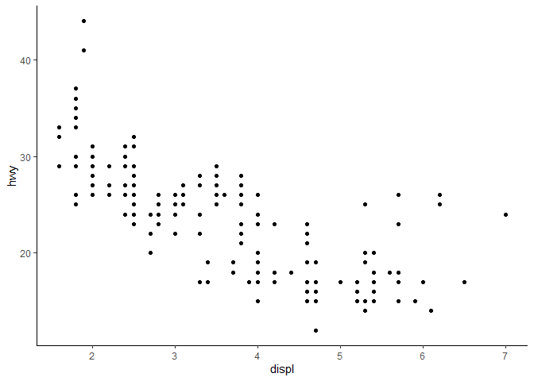<!-- -->

5.  Faceting (multiple plots)

``` r
ggplot(data = mpg, aes(x = displ, y = hwy)) + 
  geom_point() + 
  facet_wrap(~ class)
```

<!-- -->

6.  Overlaying geometric objects (geom\_\*)

``` r
# Scatter plot + line plot
ggplot(data = mpg, aes(x = displ, y = hwy)) + 
  geom_point() +
  geom_line()
```

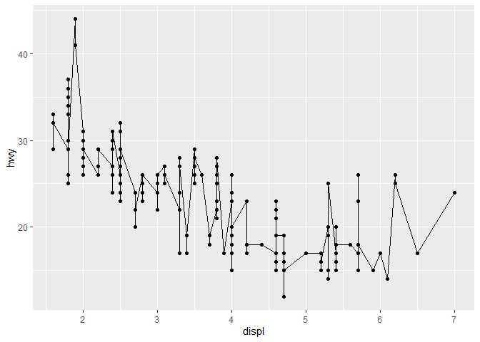<!-- -->

  

------------------------------------------------------------------------

## Further Customization

- `scale_*()`: Change the scales, like modifying colors
  (`scale_color_manual()`), continuous color scales
  (`scale_color_gradient()`), etc.

``` r
# default colors
ggplot(data = mpg, aes(x = displ, y = hwy, color = fl)) + 
  geom_point(size = 2)
```

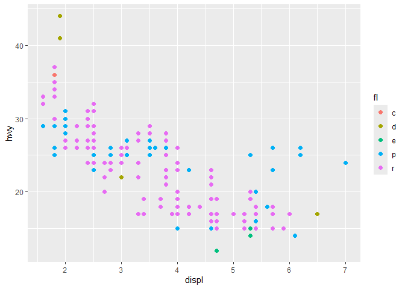<!-- -->

``` r
# use scale_color_manual() to change default colors
ggplot(data = mpg, aes(x = displ, y = hwy, color = fl)) + 
  geom_point(size = 2) +
  scale_color_manual(values = c("c" = "black", "d" = "brown1", "e" = "royalblue", "p" = "pink3", "r" = "green"))
```

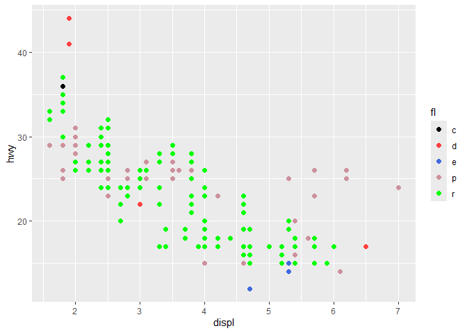<!-- -->

- `coord_*()`: Change the coordinate system (e.g., `coord_flip()` to
  rotate the plot).

``` r
# Box plot
ggplot(data = mpg, aes(x = class, y = hwy)) + 
  geom_boxplot()
```

<!-- -->

``` r
# use coord_flip() to swap x and y axes
ggplot(data = mpg, aes(x = class, y = hwy)) + 
  geom_boxplot() +
  coord_flip()
```

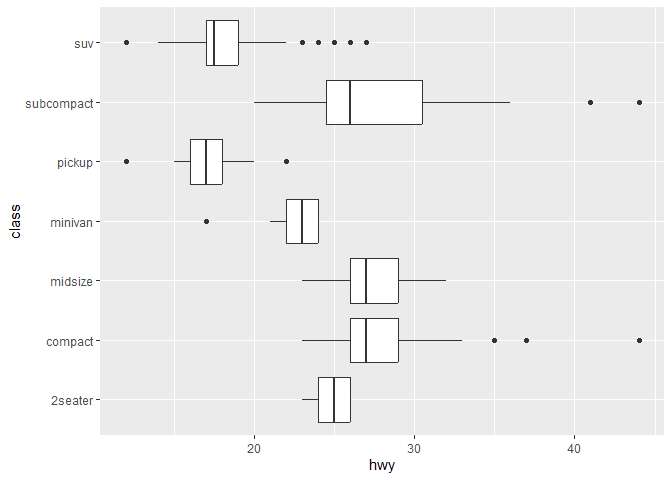<!-- -->

  

------------------------------------------------------------------------

## Summary of basic structure

``` r
ggplot(data = dataset, aes(x = x_var, y = y_var)) +                     # Step 1: Define data and aesthetics
  geom_*() +                                                            # Step 2: Add a geometric layer (scatter, bar, line, etc.)
  labs(title = "Plot Title", x = "X-axis Label", y = "Y-axis Label") +  # Step 3: Add labels
  theme_classic()                                                       # Step 4: Add a theme to customize the appearance
```

- To create a scatter plot with custom title and axis labels,
  color-coded points by class, and a minimal theme with the legend at
  the bottom

``` r
ggplot(data = mpg, aes(x = displ, y = hwy, color = class)) + 
  geom_point(size = 3) + 
  labs(title = "Engine Displacement vs Highway MPG", x = "Engine Displacement (L)", y = "Highway MPG") +
  theme_minimal() +
  theme(legend.position = "bottom")
```

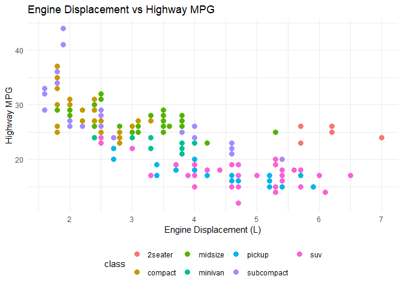<!-- -->

  

------------------------------------------------------------------------

## Exercise

- 1.  Use the `mpg` dataset to create a horizontal bar chart (flip the x
      and y axes) that shows the number of cars in each `manufacturer`.
- 2.  Create a line plot using the `economics` dataset to visualize the
      number of unemployed people in the U.S. over time. Plot `date` on
      the x-axis and `unemploy` on the y-axis, and apply the
      `theme_bw()` theme for a clean background.
- 3.  Create a histogram using the `diamonds` dataset to show the
      distribution of diamond prices. Set the bin width to 500, fill the
      bars in blue color, and outline the bars in red color.
- 4.  Use the `iris` dataset to visualize the relationship between petal
      length and petal width with `geom_scatter()`. Plot `Petal.Length`
      on the x-axis and `Petal.Width` on the y-axis, color the points by
      `species`, set the point size to 2, add an appropriate title and
      axis labels, and apply a minimal theme (`theme_minimal()`) to the
      plot.
- 5.  Create a horizontal boxplot using the `PlantGrowth` dataset to
      compare plant weights across different treatment groups. Plot
      `group` on the y-axis and `weight` on the x-axis, fill the
      boxplots by `group`, add a descriptive title and axis labels, and
      apply a classic theme to the plot.
